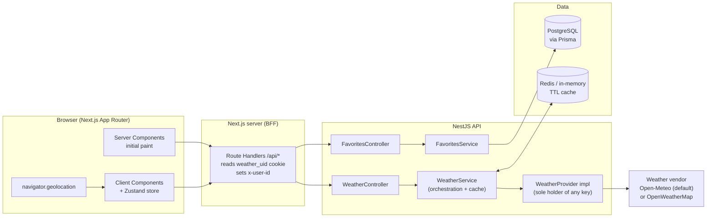
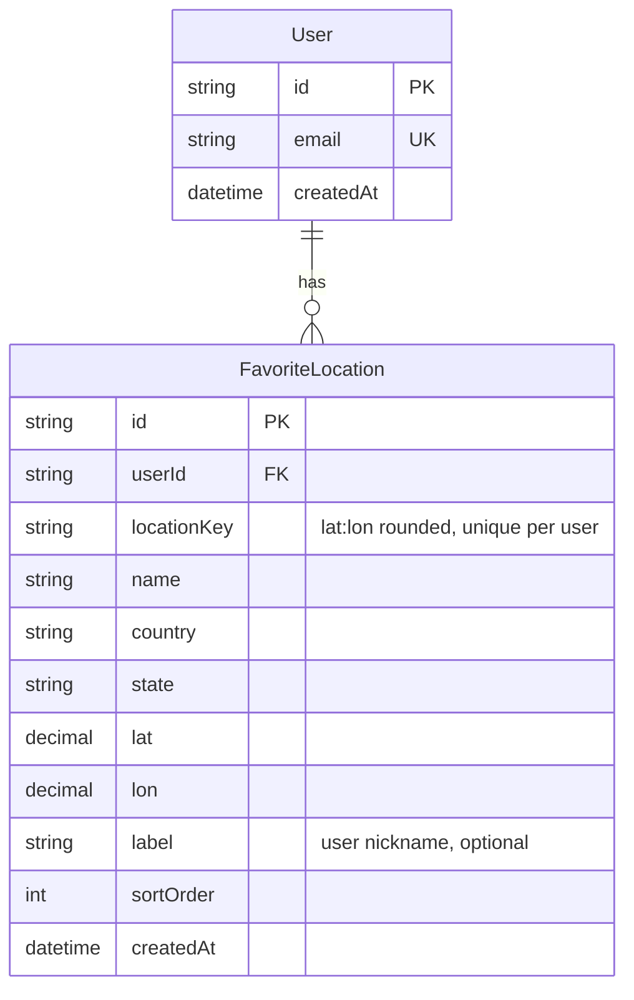

# Weather App — System Architecture

## 1. High-level architecture



### Request flow

| Flow | Path |
| --- | --- |
| Initial load (geolocation) | Client reads coords → `GET /api/weather?lat&lon` → Nest reverse-geocodes, then cache hit or vendor |
| Search result picked | `GET /api/weather?lat&lon&name&country` → name passed through, reverse geocoding skipped |
| City autocomplete | Debounced input (350 ms) → `GET /api/geo/search?q=` → Nest geocoding proxy (cached 24 h) |
| Star a city | `POST /api/favorites` → BFF attaches `x-user-id` → Prisma upsert on `(userId, locationKey)` |
| Identity | BFF mints a UUID into an httpOnly `weather_uid` cookie on first write; no login required |
| Favorites strip | `GET /api/favorites` → chips render from the stored rows alone; selecting one reuses the snapshot flow above |

### Key decisions

1. **No credential ever leaves the server.** The default provider (Open-Meteo) needs no key at all; `OpenWeatherProvider`, if bound, reads `OPENWEATHER_API_KEY` inside its own constructor and nowhere else. Nothing in `apps/web` imports either, no key is prefixed `NEXT_PUBLIC_`, and the provider scrubs request URLs out of its error logs — the key travels as a query param, so a naive log line would leak it. The browser only ever talks to our own origin.
2. **Two hops on purpose.** Next.js Route Handlers act as a thin BFF: they attach the session cookie / user id and forward to Nest over a private network. The browser never sees the Nest URL. If you later collapse to Next.js-only, `WeatherService` moves into `apps/web/src/server/` unchanged — it has no Nest-specific code beyond `@Injectable()`.
3. **Cache at the service, not the route.** Every vendor rate-limits, and most bill per call. `WeatherService` caches by a rounded coordinate key (`lat/lon` to 2 dp ≈ 1.1 km) so nearby users share entries. TTLs: snapshot 10 min, geocoding 24 h. The cache also de-duplicates in-flight requests — 50 concurrent misses cause one upstream call — and serves stale data when the vendor is down, which beats an error page for data this soft. Swap the in-memory store for Redis by changing one provider binding.
4. **One upstream call per view.** Both providers return current conditions, the daily series and UV in a single response, so rendering the dashboard is one round trip, not three. `WeatherProvider` is what makes them interchangeable: the vendor's response shape never escapes `providers/`, so switching vendors is one `useClass` line. This was proven in practice — the project moved from OpenWeather to Open-Meteo without touching `WeatherService`, any controller, or any component.
5. **Anonymous identity before authentication.** Favourites need an owner, but
   demanding a login to star a city is the wrong trade. The BFF mints a UUID into
   an httpOnly cookie and forwards it as `x-user-id`; Nest upserts a `User` row
   with `isAnonymous: true` on first write. The browser can neither read nor forge
   the cookie, and signing in later is an UPDATE on the existing row — nobody
   loses their saved cities. `apps/web/src/lib/server/user-session.ts` is the only
   file that changes when real auth arrives.
6. **Ownership lives in the WHERE clause.** `FavoritesService.remove` deletes on
   `{ id, userId }`, never on `id` alone, so guessing another user's row id
   achieves nothing. Same for every read.
7. **Coordinates are the identity, not the city name.** City names are ambiguous ("Springfield"); lat/lon is canonical and is what both the cache key and the DB unique constraint are built from.

## 2. Database schema (favorites)



**Why `locationKey`.** Floating-point columns make terrible unique keys — `51.5074` and `51.50740001` are different rows but the same city. We derive `locationKey = "${lat.toFixed(4)}:${lon.toFixed(4)}"` in the service and put the unique constraint on `(userId, locationKey)`. Starring the same city twice becomes an idempotent upsert instead of a duplicate row.

`sortOrder` supports drag-to-reorder later without a schema change. `label` lets a user rename "Kingston upon Thames" to "Home".

No weather readings are stored. Weather is derived, time-sensitive data with a 10-minute useful life — it belongs in the cache tier, not in Postgres.

## 3. Folder structure

### `apps/api` (NestJS)

```
apps/api/
├── prisma/
│   ├── schema.prisma
│   └── migrations/
└── src/
    ├── main.ts                 # bootstrap, CORS, global ValidationPipe
    ├── app.module.ts
    ├── common/
    │   ├── cache/
    │   │   ├── cache.module.ts
    │   │   └── weather-cache.service.ts   # TTL store; Redis-swappable
    │   └── filters/
    │       └── upstream-exception.filter.ts
    ├── prisma/
    │   ├── prisma.module.ts
    │   └── prisma.service.ts
    ├── weather/
    │   ├── weather.module.ts
    │   ├── weather.controller.ts          # thin: validate → delegate
    │   ├── weather.service.ts             # orchestration, caching, mapping
    │   ├── weather.types.ts               # OUR domain model
    │   ├── providers/
    │   │   ├── weather-provider.interface.ts
    │   │   └── openweather.provider.ts    # the only file that knows the key
    │   └── dto/
    │       ├── coords.dto.ts
    │       └── openweather.raw.ts         # THEIR response shape
    └── favorites/
        ├── favorites.module.ts
        ├── favorites.controller.ts
        ├── favorites.service.ts
        └── dto/create-favorite.dto.ts
```

The `dto/openweather.raw.ts` ↔ `weather.types.ts` split is the point of the whole backend: the upstream vendor shape stops at the provider boundary, and everything above it speaks our own model. Changing weather vendors touches one folder.

### `apps/web` (Next.js App Router)

```
apps/web/src/
├── app/
│   ├── layout.tsx
│   ├── page.tsx                       # renders <WeatherDashboard />
│   └── api/                           # BFF route handlers → Nest
│       ├── weather/route.ts
│       ├── geo/search/route.ts
│       └── favorites/route.ts
├── components/
│   ├── layout/                        # Header, ThemeToggle, Container
│   ├── ui/                            # Button, Card, Skeleton, Icon
│   └── weather/
│       ├── WeatherDashboard.tsx       # composition only, no fetching
│       ├── SearchBar.tsx
│       ├── SearchResults.tsx
│       ├── CurrentWeatherCard.tsx
│       ├── WeatherMetricGrid.tsx
│       ├── MetricTile.tsx
│       ├── ForecastList.tsx
│       ├── ForecastDayRow.tsx
│       ├── ForecastChart.tsx
│       ├── FavoritesBar.tsx
│       └── FavoriteStarButton.tsx
├── hooks/
│   ├── useGeolocation.ts
│   ├── useDebouncedValue.ts
│   └── useCitySearch.ts
├── lib/
│   ├── api-client.ts                  # typed fetch wrappers
│   ├── format.ts                      # temp/wind/time formatters
│   └── weather-icons.ts
├── store/
│   ├── useLocationStore.ts            # selected location + units
│   └── useFavoritesStore.ts
└── types/weather.ts                   # mirrors weather.types.ts
```

**Component rule:** files in `components/weather/` receive data as props and render. Only `WeatherDashboard` and the hooks touch the network. That keeps every card trivially testable and storybook-able.
